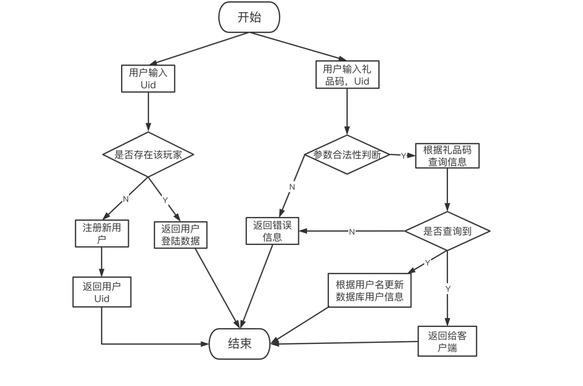

#### 1、整体框架
整体功能的实现思路为客户端传递唯一识别码,根据该字符串在数据库中查询玩家信息，玩家信息的UID为空，生成UID，唯一字符串为用户名注册用户。否则返回用户数据。根据用户名将奖励调价到玩家信息中

#### 2、目录结构
```
.
├── README.md
├── __pycache__
│   └── locustfile.cpython-39.pyc
├── app
│   ├── app
│   └── main.go
├── go.mod
├── go.sum
├── internal
│   ├── ctrl
│   │   ├── giftCodeCtrl.go
│   │   └── userCtrl.go
│   ├── dao
│   │   ├── giftCodeDao.go
│   │   └── userDao.go
│   ├── model
│   │   ├── giftCodeInfo.go
│   │   ├── giftContentList.go
│   │   ├── receiveGiftList.go
│   │   └── uer.go
│   ├── response
│   │   ├── generalReward.pb.go
│   │   └── generalReward.proto
│   ├── router
│   │   └── giftCodeRouter.go
│   ├── service
│   │   ├── giftCodeService.go
│   │   ├── giftCodeService_test.go
│   │   ├── userServer.go
│   │   └── userServer_test.go
│   ├── status
│   │   └── ginResult.go
│   ├── test
│   │   ├── locustFile.py
│   │   └── report.html
│   └── utils
│       ├── createUID.go
│       ├── getRandomString.go
│       ├── initClient.go
│       └── mongoClient.go
└── 流程图.png


```

#### 3. 代码逻辑分层


|层|文件夹|主要职责|调用关系|其他说明|
| ------------ | ------------ | ------------ | ------------ | ------------ |
|应用层 |app/http/main.go  |服务器启动 |调用路由层工具层   |不可同层调用
|路由层 |internal/router/  |路由转发 | 调用工具层 控制层 被应用层   |不可同层调用
|控制层 |internal/ctrl/ |请求参数处理，响应 | 调用service层，model层，status，response层 被路由层调用    |不可同层调用
|service层   |internal/service/GiftCodeService.go  |处理业务逻辑 | 调用工具层，被控制层调用   |可同层调用
|dao层   |internal/dao  |数据库操作，存储数据 | 调用工具层，model，response层，被service层调用    |可同层调用
|工具类   |internal/utils  |数据库链接，生成UID，生成礼包码 | 被dao层，service层调用    |不可同层调用
|model层   |internal/model  |定义结构题 | 被dao层 service，控制层调用    |不可同层调用
|response层   |internal/response  |protobuf | 被dao层 service，response层调用    |不可同层调用
|status层 |internal/status  |定义异常信息 | 被控制层，service，dao层调用    |不可同层调用

#### 4.存储设计

礼包码信息

|  内容 |数据库   | key  | 类型  |
| ------------ | ------------ | ------------ | ------------ |
|   礼品码描述| Redis  | GiftDes  |  string |
| 礼品码类型  | Redis  |  CodeType |   int|
|  礼品码类型描述 |  Redis | CodeTypeDesc  | string  |
|  已经领取次数 | Redis  |  ReceiveNum |int   |
| 可以领取的次数  |Redis   |  AvailableTimes |  int |
|  有效期 |Redis   |  ValidPeriod | int  |
|  礼包内容 |  Redis | Contents  |   int|
|  礼包码 |  Redis | Code  |  string |
|  创建人 | Redis  |  Creator |  string |
|  创建时间 |  Redis |CreatTime   |time.Time   |
|  礼品内容列表 | Redis  | ContentList  |  GiftContentList |
|  领取列表 |  Redis |  ReceiveList |[]ReceiveGiftList   |
|  指定用户 |  Redis |  User |  string |

礼包领取用户

|  内容 |数据库   | key  | 类型  |
| ------------ | ------------ | ------------ | ------------ |
| 领取用户名  | Redis  |ReceiveUser   | string  |
|  领取时间 | Redis  | ReceiveTime  |time.Time   |

玩家信息

|  内容 |数据库   | key  | 类型  |
| ------------ | ------------ | ------------ | ------------ |
|  用户名 |  Mongodb |UserName   |  string |
| UID  |Mongodb   | UID  | string  |
|  金币 |  Mongodb |  GoldCoins | int  |
|  钻石 | Mongodb  |Diamonds   |  int |


#### 5. 接口设计

```
1.接口描述：
新增注册与登录接口：客户端传递唯一识别码（一个任意字符串）至服务器，服务器通过该识别码判断是否存在该玩家：不存在则注册新用户，生成唯一UID；存在则返回用户登陆数据（唯一UID、金币数、钻石数）。

请求方法：
Http Get

请求地址：
http://127.0.0.1:8080/UserLoginCtrl

请求参数：
字段     类型       描述
uid      string      string

请求响应：
没有注册：
{
    "code": 200,
    "msg": "注册成功,请记住唯一UID",
    "data": {
        "uid": "50FYYX",
        "gold_coins": 0,
        "diamonds": 0
    }
}
已注册：
{
    "code": 200,
    "msg": "OK",
    "data": {
        "uid": "OV21YU",
        "gold_coins": 1776,
        "diamonds": 1998
    }
}
响应状态码：
状态码		说明
200			通用成功
1007		请输用户Uid
1016		 mongdb数据库异常
```
```
2.接口描述：
客户端调用 - 验证礼品码：验证礼品码接口修改：按照管理员所添加的金币与钻石奖励数目，发放奖励存储至数据库。编译protobuf文件，将返回信息封装为protobuf对象以 []byte 作为接口返回值返回给客户端。客户端接收到的是二进制序列

请求方法：
Http Get

请求地址：
http://127.0.0.1:8080/GetGiftCodeInfo 

请求参数：
字段		 类型			描述
code		 string		礼品码
uid			string		用户uid

请求响应：
{
    "code": 200,
    "msg": "OK",
    "data": {
        "gold_coins": 888,
        "diamonds": 999,
        "props": 0,
        "heroes": 0,
        "creeps": 0
    }
}

响应状态码：
状态码 			说明
200				通用成功
1003			礼包码输入错误
1007			请输用户Uid 
1017			礼包码无效
```

#### 6. 如何编译执行

`
go build
`

`
./app
`

#### 7、todo

代码分层进一步优化，方法抽取复用


#### 8、todo


